# 电路板LED检测程序使用指南

此文档针对使用者，开发者还需阅读README4DEV.pdf

> + 一个“模式”：控制版发出控制信号，到led板做出反应并被检测到的一个完整周期。
> + 最好将检测装置置于黑暗环境下，如加上一个盖子。

## 启动

Terminal中，在程序所在文件夹下输入:
``` 
python GUI.py
``` 


## 主界面

主界面如下图所示:

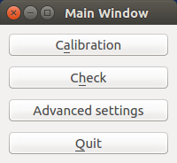

+ __Calibration__: 自动校准，当每个模式下对应的led亮灭情况有改动(如：换了新的led板/控制程序有变更)，则需要点击此按钮进入校准子界面。
+ __Check__: 检测待测板，当已有标准的校准数据后，点击此按钮进入校准子界面。
+ __Advanced settings__: 高级设置，当需要调节曝光度范围等系统参数时，点击此按钮进行调节。此项须在校准和检测之前进行。当重新启动检测系统（非关闭界面）时需重新调节。
+ __Quit__: 关闭主界面。（退出主界面不会使检测系统断电）

## Calibration

Calibration界面如下图所示：

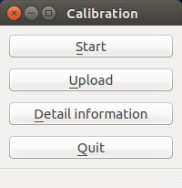


### Start 

开始校准，开始后保持检测装置不动，观察下方状态栏的模式计数。

> 有时会弹出长期无响应，请求强制关闭的窗口，只要计数在1分钟内还增加即可选择继续等待，一般不要选择强制关闭。

运行时状态栏如下图：

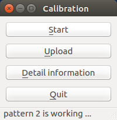

当所有模式完成后，即显示”Calibration finished“，如下图：

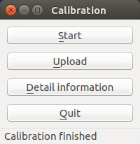

### Detail information

为了保证检测系统处于正常工作状态，可在Calibration界面点击”Detail Information“查看每个模式的led具体亮灭情况。

查看界面如下图所示：

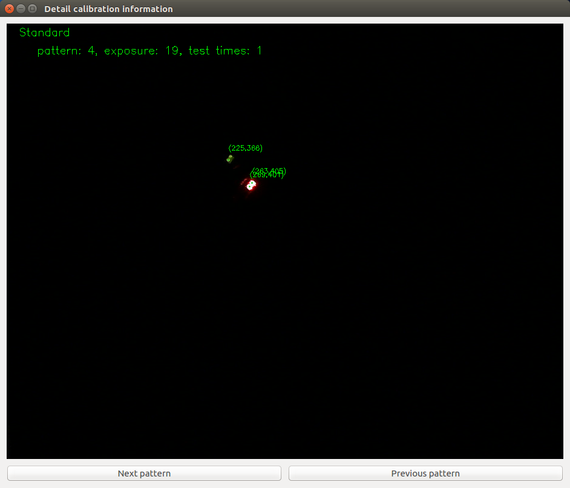

> + Standard: 校准标签，表示这是校准功能产生的图像，用于区别检测时产生的图像。
> + pattern: 模式标号，如图中表示这是模式4对应的图像。
> + exposure: 最大曝光度， 如图中表示校准时的最大曝光度为19,也即此图对应的曝光度为19。这与Advanced settings中的一致。
> + test time: 测试数， 如图中表示每个模式测1次，也即此图为对应第1次测试，这与Advanced settings中的一致。
> + 绿色坐标： 表示探测到的led位置。坐标规定如下：

      —————————— 第二个值
      |
      |
      |
      |
      |第一个值
> + Next pattern: 查看下一个模式对应的图像。
> + Previous pattern: 查看上一个模式对于的图像。

如果发现错误，则需要检测是否在黑暗环境下等条件，若多次探测都有问题，请联系开发者。

### Upload
当查看具体信息没有错误后，可以选择上传此次校准结果为标准数据。关闭Detail Information 子界面，回到Calibration界面后，点击Upload即可，完成时状态栏如下图所示：

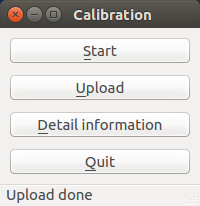

若结果不为此，请检查网络链接状态。

### Quit

校准流程结束后，点击Quit或者直接关闭Calibration界面都可回到主界面。

## Check

Check界面如下图所示：

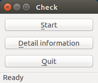

### Start
测试与校准的流程相似，运行时状态栏如下图：

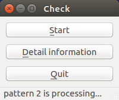

完成后状态栏如下图：

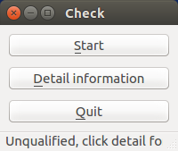

此图表示这此测试不合格，需要查看具体不合格信息。如果合格，则显示”Qualified“。

### Detail information

当测试结果为不合格时，需要查看具体不合格信息，进行人工判断。

查看信息界面如下图所示：

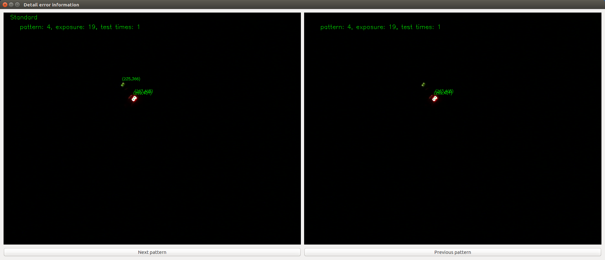

可见这与校准中的查看具体信息界面相似，相同的参数不再赘述。

> + 左边为不合格的模式对于标准数据，右边为此次测试数据。
> + Next/Previous pattern指向的是下/上一个有问题的模式。

图中此次测试偶然误判了一个亮度较低的点，此时由人工复检即可认为是合格的。

### Quit

当一系列电路板的测试结束，可点击Quit或者直接关闭check界面，退回主界面。

## Advanced settings

高级设置提调整曝光度范围和测试次数的接口。曝光度范围越大/测试次数越　多则耗时越长，对led亮度差异的包容性越好。可根据led亮度差异和时间需求综合考虑调整。服务端上电后只需调整一次，改变后按　__Enter__　键即可上传。

高级设置界面如下图所示：

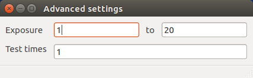

按　__Enter__　键上传后，如下图所示：

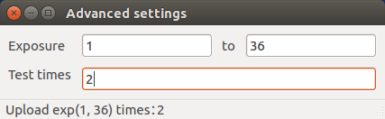

完成后直接关闭此子界面即可。
